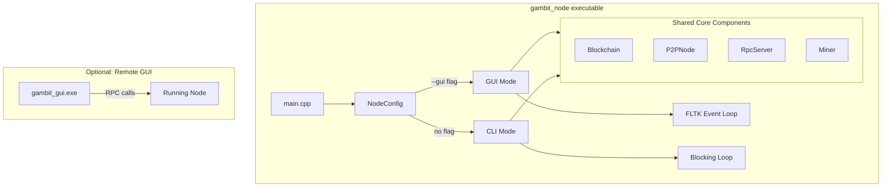

# Unified GUI/CLI Node with RPC Support

## Current Problem

- [`gui/main_gui.cpp`](gui/main_gui.cpp) duplicates all blockchain initialization from [`app/main.cpp`](app/main.cpp)
- Two separate executables that don't share code
- `NodeConfig.enableGUI` exists but is unused

## Architecture

## Implementation Plan

### 1. Create a shared Node class

Extract the core node setup from `main.cpp` into a reusable `Node` class in [`include/gambit/node.hpp`](include/gambit/node.hpp):

- Holds Blockchain, P2PNode, RpcServer, Miner instances
- Accepts `NodeConfig` for configuration
- Provides accessors for GUI to use

### 2. Refactor GUI to use Node class

Modify [`gui/main_gui.cpp`](gui/main_gui.cpp):

- Remove duplicated blockchain/p2p/miner initialization
- Accept `Node*` reference or connect via RPC URL
- Two modes: **embedded** (uses Node directly) or **remote** (connects via RPC)

### 3. Integrate GUI into main executable

Update [`app/main.cpp`](app/main.cpp):

- Wire up the existing `--gui` flag parsing
- When `enableGUI=true`, launch GUI with shared Node instance
- FLTK event loop replaces the blocking `while(true)` loop

### 4. Keep standalone GUI option

Update [`gui/main_gui.cpp`](gui/main_gui.cpp) to support RPC mode: